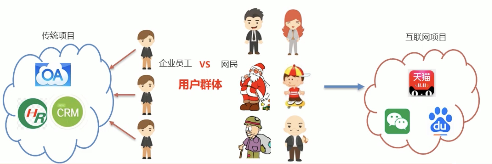
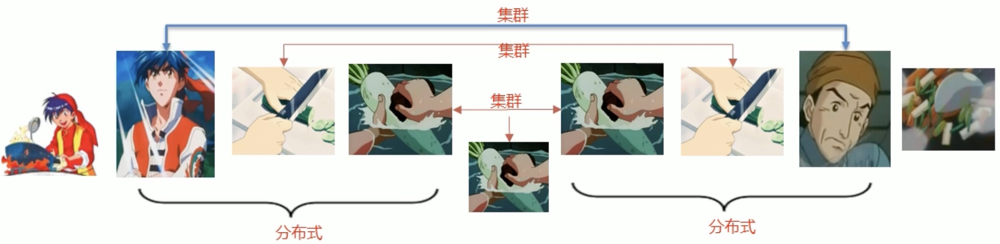
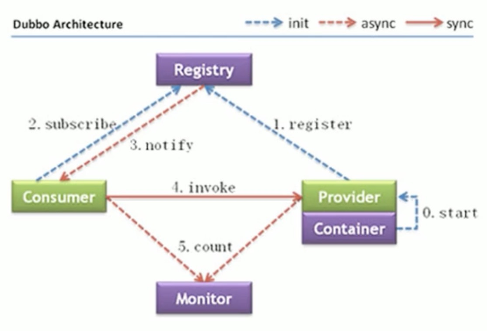

# 1.分布式系统中的相关概念

## 大型互联网项目架构目标

传统项目和互联网项目

互联网项目特点

- 用户多
- 流量大，并发高
- 海量数据
- 易受攻击
- 功能繁琐
- 变更快

## 集群和分布式

- 集群：很多“人”一起，干一样的事。
  - 一个业务模块，部署在多台服务器上。
- 分布式：很多“人”一起，干不一样的事。这些不一样的事，合起来是一件大事。
  - 一个大的业务系统，拆分为小的业务模块，分别部署在不同的机器上。

## 架构演进

Dubbo 是 SOA时代的产物，SpringCloud 是微服务时代的产物

# 2.Dubbo概述

- Dubbo 是阿里巴巴公司开源的一个高性能、轻量级的 Java RPC 框架
- 致力于提供高性能和透明化的 RPC 远程服务调用方案，以及 SOA 服务治理方案
- 官网：http://dubbo.apache.org

Dubbo 架构

- Provider：暴露服务的服务提供方
- Container：服务运行容器
- Consumer：调用远程服务的服务消费方
- Registry：服务注册与发现的注册中心
- Monitor：统计服务的调用次数和调用时间的监控中心

实现步骤

1. 创建服务提供者 Provider 模块
2. 创建服务消费者 Consumer 模块
3. 在服务提供者模块编写 UserServicelmpl 提供服务
4. 在服务消费者中的 UserController 远程调用 UserServicelmpl 提供的服务
5. 分别启动两个服务，测试

# 3.Dubbo快速入门

# 4.Dubbo高级特性
