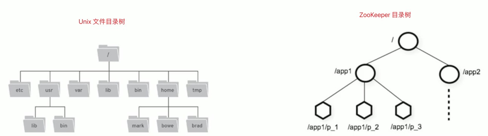
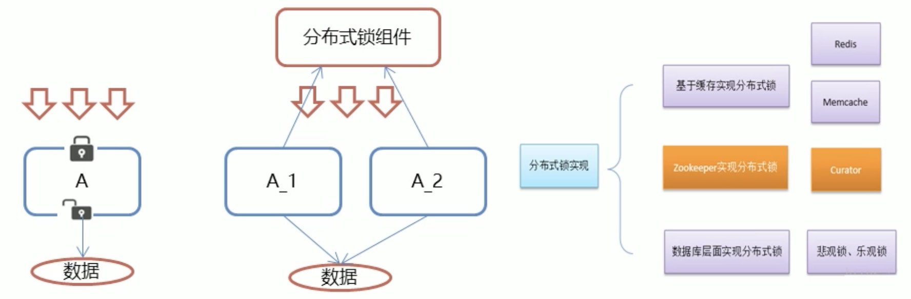
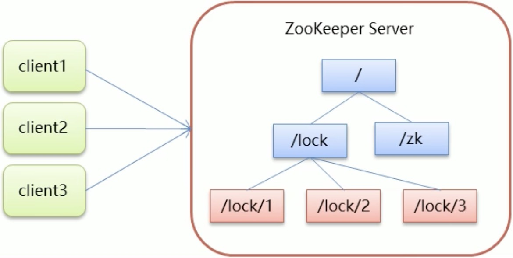

# Mac安装

官网下载后解压改名为 zookeeper，然后更改位置为：/usr/local/zookeeper

然后在该位置下创建 data 文件：/usr/local/zookeeper/data

进入 /usr/local/zookeeper/conf，复制 zoo_sample.cfg 为 zoo.cfg，并修改其内容：

```bash
# 配置 Zookeeper 数据存储目录
dataDir=/usr/local/zookeeper/data
```

启动

```bash
# 启动服务端
/usr/local/zookeeper/bin/zkServer.sh start
# 关闭服务端
/usr/local/zookeeper/bin/zkServer.sh stop
# 重启服务端
/usr/local/zookeeper/bin/zkServer.sh restart
# 查看服务端状态
/usr/local/zookeeper/bin/zkServer.sh status

# 客户端连接服务端
/usr/local/zookeeper/bin/zkCli.sh
/usr/local/zookeeper/bin/zkCli.sh -server 127.0.0.1:2181
```

# 1.简介

- Zookeeper 是 Apache Hadoop 项目下的一个子项目，是一个树形目录服务。
- Zookeeper 翻译过来就是动物园管理员，他是用来管理 Hadoop(大象)、Hive(蜜蜂)、Pig(小猪)的管理员。简称 zk
- Zookeeper 是一个分布式的、开源的分布式应用程序的协调服务。
- Zookeeper 提供的主要功能包括：
  - 配置管理
  - 分布式锁
  - 集群管理

# 2.命令操作

## 数据模型

- ZooKeeper 是一个树形目录服务，其数据模型和 Unix 的文件系统目录树很类似，拥有一个层次化结构。
- 这里面的每一个节点都被称为：ZNode，每个节点上都会保存自己的数据和节点信息。
- 节点可以拥有子节点，同时也允许少量（1MB）数据存储在该节点之下。
- 节点可以分为四大类：
  - PERSISTENT 持久化节点
  - EPHEMERAL 临时节点：-e
  - PERSISTENT_SEQUENTIAL 持久化顺序节点：-s
  - EPHEMERAL_SEQUENTIAL 临时顺序节点：-es



## 服务端常用命令

```bash
# 启动服务端
/usr/local/zookeeper/bin/zkServer.sh start
# 关闭服务端
/usr/local/zookeeper/bin/zkServer.sh stop
# 重启服务端
/usr/local/zookeeper/bin/zkServer.sh restart
# 查看服务端状态
/usr/local/zookeeper/bin/zkServer.sh status
# 查看 zookeeper 版本
/usr/local/zookeeper/bin/zkServer.sh version
```

## 客户端常用命令

```bash
# 客户端连接服务端
/usr/local/zookeeper/bin/zkCli.sh
/usr/local/zookeeper/bin/zkCli.sh -server 127.0.0.1:2181

# 查看所有命令
help

# 查看根节点下的所有节点
ls /
# 查看根节点下的 name 节点下的所有节点
ls /name
# 查看根节点详细信息
ls -s /

# 创建 name 持久化节点，值为 zhangsan，节点名不能重复
create /name zhangsan
# 创建 age 持久化节点，值为 null，节点名不能重复
create /age
# 创建 age 临时节点，客户端断开连接会删除，节点名不能重复
create -e /age
# 创建 age 持久化顺序节点，创建出来的节点名称后面会带自增编号，所以节点名可以重复
create -s /age
# 创建 age 临时顺序节点，客户端断开连接会删除，创建出来的节点名称后面会带自增编号，所以节点名可以重复
create -es /age

# 获取 name 节点的值
get /name

# 修改 age 节点的值为 18
set /age 18

# 删除 user 节点（节点下有子节点无法删除）
delete /user
# 删除 user 节点，包括其下面所有子节点
deleteall /user
```

# 3.JavaAPI操作

## CuratorAPI操作

### 建立连接

```java
// 建立的连接对象
private CuratorFramework curatorFramework;

/**
 * 建立连接
 */
@Before
public void before1() {
    // 建立连接 - newClient 方式
//        curatorFramework = CuratorFrameworkFactory.newClient(
//                // 连接地址和端口
//                "127.0.0.1:2181",
//                // 会话超时时间，默认60秒
//                60000,
//                // 连接超时时间，默认15秒
//                15000,
//                // 重试策略，以下表示每1秒重试一次，最多重试3次
//                new ExponentialBackoffRetry(1000, 3)
//        );

    // 建立连接 - builder 方式
    curatorFramework = CuratorFrameworkFactory.builder()
            // 连接地址和端口
            .connectString("127.0.0.1:2181")
            // 会话超时时间，默认60秒
            .sessionTimeoutMs(60000)
            // 连接超时时间，默认15秒
            .connectionTimeoutMs(15000)
            // 重试策略，以下表示每1秒重试一次，最多重试3次
            .retryPolicy(new ExponentialBackoffRetry(1000, 3))
            // 可选择指定名称空间，将来都操作 test 下的节点
            .namespace("test")
            // 最后 build 一下
            .build();

    // 开启连接
    curatorFramework.start();
}

/**
 * 关闭连接
 */
@After
public void after1() {
    if (curatorFramework != null) {
        curatorFramework.close();
    }
}
```

### 查询节点

```java
/**
 * 查询节点
 */
@Test
public void test1() throws Exception {
    // 查询指定节点下的所有子节点
    List<String> list = curatorFramework.getChildren().forPath("/");
    System.out.println(list); // [name40000000030, name6, name40000000031, name, name2]

    // 获取节点的值
    byte[] bytes = curatorFramework.getData().forPath("/name");
    System.out.println(new String(bytes)); // 127.0.0.1

    // 获取节点的详细信息
    Stat stat = new Stat();
    bytes = curatorFramework.getData().storingStatIn(stat).forPath("/name");
    System.out.println(new String(bytes)); // 127.0.0.1
    System.out.println("详细信息：\n" +
            "czxid：" + stat.getCzxid() + "\n" +
            "mzxid：" + stat.getMzxid() + "\n" +
            "ctime：" + stat.getCtime() + "\n" +
            "mtime：" + stat.getMtime() + "\n" +
            "version：" + stat.getVersion() + "\n" +
            "cversion：" + stat.getCversion() + "\n" +
            "aversion：" + stat.getAversion() + "\n" +
            "ephemeralOwner：" + stat.getEphemeralOwner() + "\n" +
            "dataLength：" + stat.getDataLength() + "\n" +
            "numChildren：" + stat.getNumChildren() + "\n" +
            "pzxid：" + stat.getPzxid()
    );
}
```

### 创建节点

```java
/**
 * 创建节点
 */
@Test
public void test2() throws Exception {
    // 创建持久化节点，不赋值默认为 当前客户端的IP(127.0.0.1)
    String s = curatorFramework.create().forPath("/name");
    System.out.println(s); // /name

    // 创建持久化节点，值为 zhangsan
    curatorFramework.create().forPath("/name2", "zhangsan".getBytes());

    // 创建临时节点
    curatorFramework.create().withMode(CreateMode.EPHEMERAL).forPath("/name3", "zhangsan".getBytes());

    // 创建持久化顺序节点
    curatorFramework.create().withMode(CreateMode.PERSISTENT_SEQUENTIAL).forPath("/name4", "zhangsan".getBytes());
    curatorFramework.create().withMode(CreateMode.PERSISTENT_SEQUENTIAL).forPath("/name4", "zhangsan".getBytes());

    // 创建临时顺序节点
    curatorFramework.create().withMode(CreateMode.EPHEMERAL_SEQUENTIAL).forPath("/name5", "zhangsan".getBytes());
    curatorFramework.create().withMode(CreateMode.EPHEMERAL_SEQUENTIAL).forPath("/name5", "zhangsan".getBytes());

    // 创建多层节点
    // creatingParentsIfNeeded()：如果父节点不存在，则创建父节点
    curatorFramework.create().creatingParentsIfNeeded().forPath("/name6/name6_son", "zhangsan".getBytes());
}
```

### 修改节点

```java
/**
 * 修改节点
 */
@Test
public void test3() throws Exception {
    // 修改 name 为 longyuhuan
    Stat stat = curatorFramework.setData().forPath("/name", "longyuhuan".getBytes());
    System.out.println(stat); // 返回的是节点详细信息对象

    // 根据版本号修改
    // 查询节点当前版本号
    stat = new Stat();
    curatorFramework.getData().storingStatIn(stat).forPath("/name");
    System.out.println(stat.getVersion());
    // 执行修改
    curatorFramework.setData().withVersion(stat.getVersion()).forPath("/name", "longyuhuan".getBytes());
}
```

### 删除节点

```java
/**
 * 删除节点
 */
@Test
public void test4() throws Exception {
    // 删除无子节点的节点
    curatorFramework.delete().forPath("/name");

    // 删除有子节点的节点
    curatorFramework.delete().deletingChildrenIfNeeded().forPath("/name6");

    // 必须删除成功，如果删除失败会重试直到成功
    curatorFramework.delete().guaranteed().forPath("/name2");

    // 删除成功后的回调
    curatorFramework.delete().guaranteed().inBackground((curatorFramework, curatorEvent) -> {
        System.out.println("删除成功");
        System.out.println("curatorFramework：" + curatorFramework);
        System.out.println("curatorEvent：" + curatorEvent);
    }).forPath("/name3");
}
```

### watch 事件监听

zookeeper 提供了三种 watcher：

- NodeCache：监听指定节点
- PathChildrenCache：监听指定节点的下一级的所有子节点
- TreeCache：监听指定节点和其所有的子节点

```java
/**
 * NodeCache：监听指定节点
 */
@Test
public void test1() throws Exception {
    // 创建 NodeCache 对象
    NodeCache nodeCache = new NodeCache(curatorFramework, "/name");

    // 注册监听
    nodeCache.getListenable().addListener(() -> {
        System.out.println("节点变化了");
        // 获取改变后的节点值
        byte[] data = nodeCache.getCurrentData().getData();
        System.out.println("变化后的节点值：" + new String(data));
    });

    // 开启监听
    nodeCache.start(true);

    while (true) {
    }
}

/**
 * PathChildrenCache：监听指定节点的下一级的所有子节点
 */
@Test
public void test2() throws Exception {
    // 创建 PathChildrenCache 对象
    PathChildrenCache pathChildrenCache = new PathChildrenCache(curatorFramework, "/name", true);

    // 注册监听
    pathChildrenCache.getListenable().addListener((curatorFramework, pathChildrenCacheEvent) -> {
        System.out.println("节点变化了");
        System.out.println(pathChildrenCacheEvent);
        // 获取改变后的节点值
        // 获取事件类型
        PathChildrenCacheEvent.Type type = pathChildrenCacheEvent.getType();
        // 判断是修改
        if (type == PathChildrenCacheEvent.Type.CHILD_UPDATED) {
            byte[] data = pathChildrenCacheEvent.getData().getData();
            System.out.println("变化后的节点值：" + new String(data));
        }
    });

    // 开启监听
    pathChildrenCache.start();

    while (true) {
    }
}

/**
 * TreeCache：监听指定节点和其所有的子节点
 */
@Test
public void test3() throws Exception {
    // 创建 TreeCache 对象
    TreeCache treeCache = new TreeCache(curatorFramework, "/name");

    // 注册监听
    treeCache.getListenable().addListener((curatorFramework, treeCacheEvent) -> {
        System.out.println("节点变化了");
        System.out.println(treeCacheEvent);
        // 获取改变后的节点值
        // 获取事件类型
        TreeCacheEvent.Type type = treeCacheEvent.getType();
        // 判断是修改
        if (type == TreeCacheEvent.Type.NODE_UPDATED) {
            byte[] data = treeCacheEvent.getData().getData();
            System.out.println("变化后的节点值：" + new String(data));
        }
    });

    // 开启监听
    treeCache.start();

    while (true) {
    }
}
```

## 分布式锁

- 在我们进行单机应用开发，涉及并发同步的时候，我们往往采用 synchronized 或者 Lock 的方式来解决多线程间的代码同步问题这时多线程的运行都是在同一个JVM之下，没有任何问题。
- 但当我们的应用是分布式集群工作的情况下，属于多JM下的工作环境，跨JVM之间已经无法通过多线程的锁解决同步问题。
- 那么就需要一种更加高级的锁机制，来处理这种跨机器的进程之间的数据同步问题——这就是分布式锁。



### Zookeeper分布式锁原理

- 核心思想：当客户端要获取锁，则创建节点，使用完锁，则删除改节点。
- 客户端获取锁时，在 lock 节点下创建临时顺序节点。
- 然后获取 lock 下面的所有子节点，客户端获取到所有的子节点之后，如果发现自己创建的子节点序号最小，那么就认为该客户端获取到了锁。使用完锁后，将该节点删除。
- 如果发现自己创建的节点并非 lock 所有子节点中最小的，说明自己还没有获取到锁，此时客户端需要找到比自己小的那个节点，同时对其注册事件监听器，监听删除事件。
- 如果发现比自己小的那个节点被删除，则客户端的 Watcher 会收到相应通知，此时再次判断自己创建的节点是否是 lock 子节点中序号最小的，如果是则获取到了锁，如果不是则重复以上步骤继续获取到比自己小的一个节点并注册监听。



### Curator实现分布式锁API

- InterProcessSemaphoreMutex：分布式排它锁(非可重入锁)
- InterProcessMutex：分布式可重入排它锁
- InterProcessReadWriteLock：分布式读写锁
- InterProcessMultiLock：将多个锁作为单个实体管理的容器
- InterProcessSemaphoreV2：共享信号量

### 模拟12306售票案例

Ticket12306.java

```java
/**
 * 12306售票类
 */
public class Ticket12306 implements Runnable {

    // 票数
    private int ticketNum = 10;
    // 分布式锁（分布式可重入排它锁）
    private InterProcessMutex lock;

    Ticket12306() {
        // 建立连接 - builder 方式
        CuratorFramework curatorFramework = CuratorFrameworkFactory.builder()
                .connectString("127.0.0.1:2181")
                .sessionTimeoutMs(60000)
                .connectionTimeoutMs(15000)
                .retryPolicy(new ExponentialBackoffRetry(1000, 3))
                .build();

        // 开启连接
        curatorFramework.start();

        // 创建分布式锁对象
        lock = new InterProcessMutex(curatorFramework, "/lock");
    }

    @Override
    public void run() {
        while (true) {
            try {
                // 获取锁，每次获取排队等待2秒
                lock.acquire(2, TimeUnit.SECONDS);

                // 售票逻辑操作
                if (ticketNum > 0) {
                    System.out.println(Thread.currentThread() + "：" + ticketNum);
                    Thread.sleep(100);
                    ticketNum--;
                } else {
                    System.out.println("已售罄：" + ticketNum + "==" + Thread.currentThread());
                    break;
                }
            } catch (Exception e) {
                e.printStackTrace();
            } finally {
                // 释放锁
                try {
                    lock.release();
                } catch (Exception e) {
                    e.printStackTrace();
                }
            }
        }
    }

}
```

LockTest.java

```java
/**
 * 买票类
 */
public class LockTest {

    public static void main(String[] args) {
        Ticket12306 ticket12306 = new Ticket12306();

        // 创建客户端去买票
        Thread t1 = new Thread(ticket12306, "携程");
        Thread t2 = new Thread(ticket12306, "飞猪");

        t1.start();
        t2.start();
    }

}
```

# 4.集群搭建

# 5.核心理论
